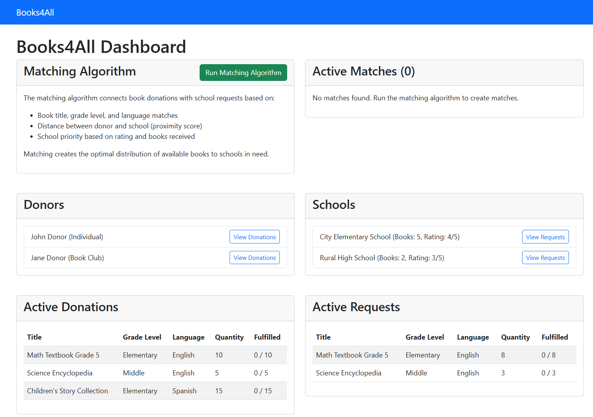

# 📚 BookBridge

**BookBridge** is a platform that connects book donors with schools in need. It uses a smart matching algorithm to ensure books find the right homes based on availability, demand, proximity, and priority.

## ✨ Features

- 📦 Add and manage donated/requested books  
- 🏫 School and donor user flows  
- ⚖️ Intelligent book-to-school matching system  
- 📊 Status tracking of donations (pending → delivered)

## 🚀 Getting Started

```bash
git clone https://github.com/ishi-ta-lal/BookBridge.git
cd BookBridge
python db_setup.py
python app.py
```

Runs locally at: [http://localhost:5000](http://localhost:5000)

## 🛠️ Database Setup

- Before running the matching algorithm, ensure you set up the database.
- The `db_setup` file contains mock data used for testing and matching logic.
- Run the database setup first to initialize collections and populate sample data.
- Once the database is ready, you can execute the matching algorithm which works based on the available data.

## 🧠 Matching Logic

BookBridge matches donated books to those in need using the following criteria:

- 📍 **Location-Based Matching**: Prioritizes schools or organizations nearest to the donor for quick and easy delivery.
- 📊 **Need-Based Preference**: Institutions that have received the **least number of books** are given priority to ensure equitable distribution.
- 📚 **Book Details Matching**: Matches books based on:
  - **Title**
  - **Language**
  - **Author**

This logic ensures fair, efficient, and meaningful book donations.

## 🤝 Contributing

Pull requests and suggestions are welcome! If you'd like to contribute, please fork the repository and make changes as you'd like. Feel free to open issues for any bugs or feature requests.

## 📸 Demo

<!-- Replace `demo.png` with your actual image path -->

